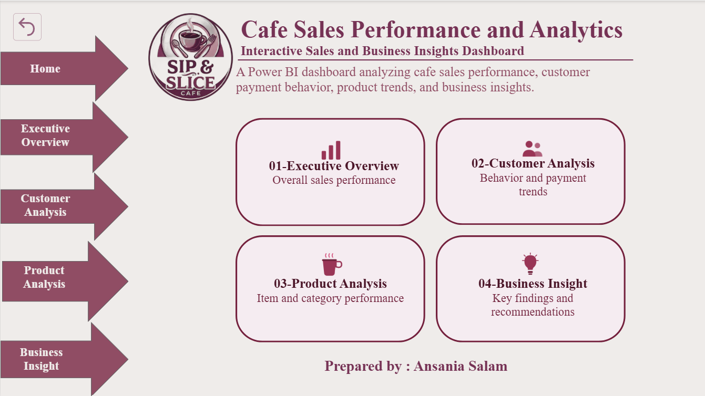
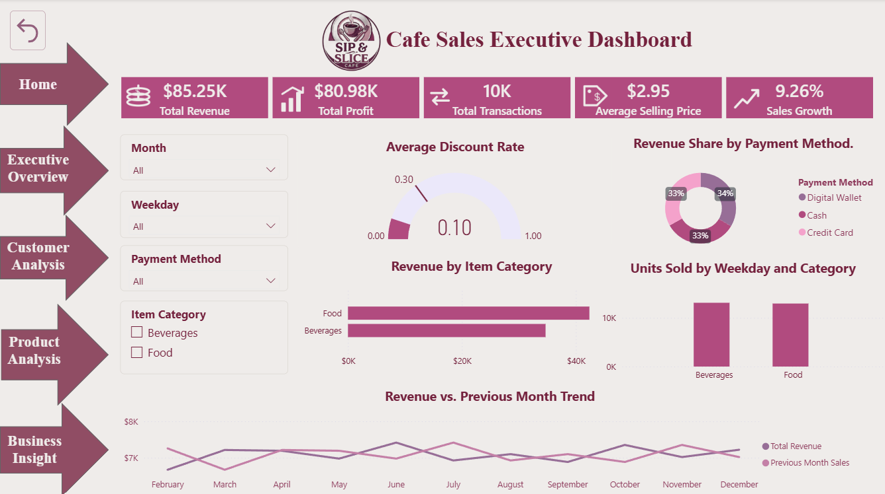
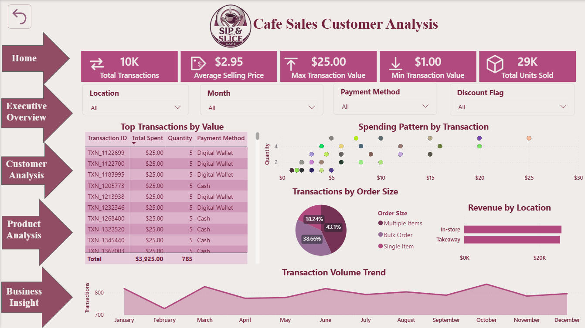
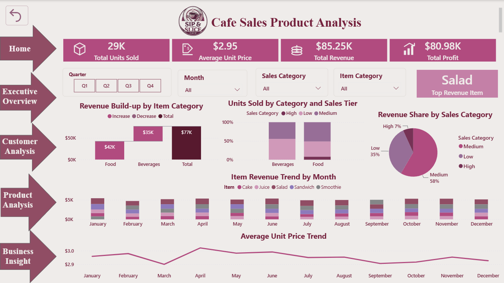
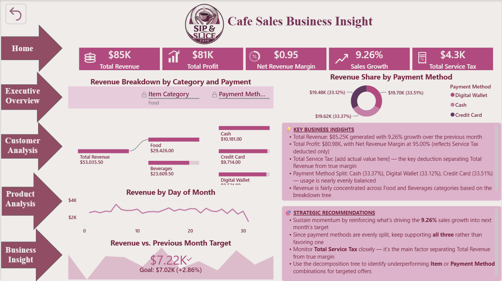
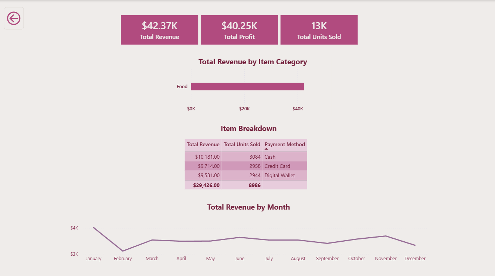

# Cafe Sales Performance and Analytics

## Interactive Sales and Business Insights Dashboard
A Power BI dashboard analyzing cafe sales performance, customer payment behavior, product trends, and business insights.

## Tools Used
- Microsoft Excel – Data cleaning and transformation
- Power BI – Data modeling, DAX, and dashboard creation

## Project Work
- Cleaned and transformed the raw sales data in Excel
- Built a data model in Power BI
- Created DAX measures and calculated columns
- Designed 6 dashboard pages with interactive slicers and page navigation
- Added a Reset bookmark for quick filter clearing
- Included a hidden drill-through page (Item Details) for detailed views

## Dashboards
1. Home
2. Executive Overview – Overall sales performance
3. Customer Analysis – Behavior and payment trends
4. Product Analysis – Item and category performance
5. Business Insight – Key findings and recommendations
6. Item Details (hidden drill-through page)

## 📊 Dashboard Preview

### 🏠 Home

### 📈 Executive Overview

### 👥 Customer Analysis

### 📦 Product Analysis

### 💡 Business Insight

### 🔍 Item Details (Drillthrough)

## Key Insights
- Total revenue: $85.25K, with total profit of $80.98K (net revenue margin ~95%)
- Sales grew 9.26% over the previous month
- 10K total transactions and 29K total units sold, at an average selling price of $2.95
- Payment methods are almost evenly split: Digital Wallet (34%), Cash (33%), Credit Card (33%)
- Salad was the top revenue-generating item
- Food category outperformed Beverages in total revenue
- Single-item orders made up the largest share of transactions (43.1%), followed by bulk orders (38.66%)
- Revenue was split closely between in-store and takeaway sales
- Monthly transaction volume stayed fairly steady through the year, with a rise toward Q4
- Revenue tracked slightly ahead of target ($7.22K vs. a $7.02K goal, +2.86%)

## 📁 Project Files
- Cafe Sales Performance and Analytics.pbix – Power BI project file
- Dashboard-Preview/ – Folder containing screenshots of all dashboard pages
- Cafe_Sales_Raw_Data.csv – Original, unprocessed sales data
- Cafe_Sales_Cleaned_Data.xlsx – Cleaned and transformed data used for analysis
- Cafe_Sales_Project_Report.pdf – Full project report with methodology and findings

## Project Author
Ansania Salam
